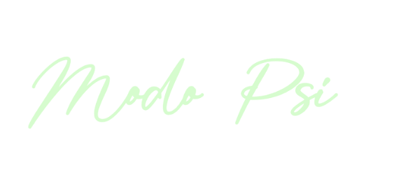

 

- [Modo Psi](#modo-psi)

- [Sobre el Proyecto](#sobre-el-proyecto)

- [Objetivo](#objetivo)

- [Mockups](#mockups)
  
- [Tecnologías](#tecnologías)

- [Herramientas](#herramientas)

- [Versiones](#versiones)

- [Modelo de base de datos](#modelo-de-base-de-datos)

- [Instalación](#instrucciones-de-instalación)

- [Desarrolladora](#desarrolladora)

### Modo Psi
Como proyecto freelance se me ha solicitado la creación de una página web dirigida a usuarios de atención psicológica.
En esta plataforma, los usuarios tendrán la oportunidad de visualizar información sobre los tipos de terapia ofrecidos, los profesionales que ofrecen prestación y ponerse en contacto con la persona encargada de agendar una cita.

### Sobre el proyecto
La idea de Modopsi surge a partir de la pandemia vivida a lo largo de los años 2010 a 2023, donde en muchos casos hubo que recurrir a la opción tanto de ofrecer como de recibir servicios de manera virtual. Debido a esto se genera en el cliente, la idea de ofrecer una página, a partir de la cual los usuarios de la misma puedan acceder a información certera sobre atención psicológica de manera online. 

### Objetivo
 Al acceder a la página web, el usuario observa en primer lugar el logo de la empresa y una breve introducción de la misma, así mismo al hacer scroll se encuentra con información sobre La Importancia de la Salud Mental. En la parte superior se encuentra con la barra de navegación donde tiene además la posibilidad de acceder a los apartados Terapias, Equipo y Contacto. 
 En el apartado Terapias, el usuario se encuentra con las distintas posibilidades que se ofrecen y tiene la opción de acceder a cada una para encontrar información específica en cada caso. 
 En el apartado Equipo, el usuario se encuentra con los distintos profesionales que ofrecen servicio y tiene la opción de acceder a cada uno para obtener información específica de los mismos.
 En el apartado Contacto, el usuario se encuentra con las distintas opciones que ofrece la página para contactar al encargado de agendar una cita, o para que lo contacten a él.
 En cada una de las páginas se puede acceder directamente a traves de un botón al apartado de Contacto. 

 ### Mockups
 

### Tecnologías 
 

 

 

### Herramientas
 

 

### Versiones

-   react: 18.2.0
-   react-dom: 18.2.0
-   react-router-dom: 6.21.1
-   testing-library/jest-dom: 5.17.0
-   axios: 1.6.1
-   php: 8.1
-   laravel/framework: 10.10
-   phpunit/phpunit: 10.1
  
### Modelo de base de datos
DrawSql: https://drawsql.app/teams/lea-2/diagrams/modopsi

### Instrucciones de instalación

- Clona el repositorio en GitHub
  

**Instalación del Servidor**

- Abre el proyecto en tu editor de código y en la terminal ingresa al directorio del proyecto `./server`.
- Instala las dependencias mediante el comando `composer install`.
- Crea un archivo .env a partir del archivo .env.example. 
- Crea tu base de datos en mysql y configura el apartado de la base de datos en el archivo .env.
- Ejecuta las migraciones para crear las tablas de la base de datos `php artisan migrate`.
- Ejecuta los seeders para rellenar las tablas de la base de datos `php artisan db:seed`.
- Inicia el servidor: `php artisan serve`.

**Instalación del Cliente**

- En la terminal ingresa al directorio `./client`.
- Instala las dependencias mediante el comando `npm install`.
- Inicia el servidor: `npm start`.

### Desarrolladora

  

   <table>
    <tr>
     <td>
        

            
        

     </td>
    </tr>
     <th>
       Leandra Bujhamer
     </th>
   </table>
  

